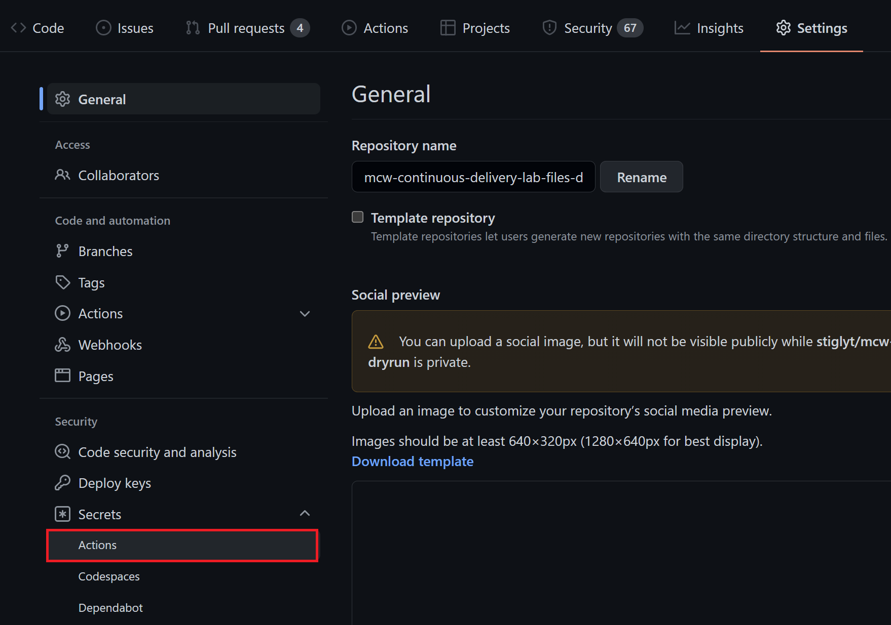

<div class="MCWHeader1">
Continuous delivery in GitHub
</div>

<div class="MCWHeader2">
Hands-on lab step-by-step
</div>

<div class="MCWHeader3">
November 2021
</div>

Information in this document, including URL and other Internet website references, is subject to change without notice. Unless otherwise noted, the example companies, organizations, products, domain names, e-mail addresses, logos, people, places, and events depicted herein are fictitious, and no association with any real company, organization, product, domain name, e-mail address, logo, person, place or event is intended or should be inferred. Complying with all applicable copyright laws is the responsibility of the user. Without limiting the rights under copyright, no part of this document may be reproduced, stored in or introduced into a retrieval system, or transmitted in any form or by any means (electronic, mechanical, photocopying, recording, or otherwise), or for any purpose, without the express written permission of Microsoft Corporation.

Microsoft may have patents, patent applications, trademarks, copyrights, or other intellectual property rights covering subject matter in this document. Except as expressly provided in any written license agreement from Microsoft, the furnishing of this document does not give you any license to these patents, trademarks, copyrights, or other intellectual property.

The names of manufacturers, products, or URLs are provided for informational purposes only and Microsoft makes no representations and warranties, either expressed, implied, or statutory, regarding these manufacturers or the use of the products with any Microsoft technologies. The inclusion of a manufacturer or product does not imply endorsement of Microsoft of the manufacturer or product. Links may be provided to third-party sites. Such sites are not under the control of Microsoft and Microsoft is not responsible for the contents of any linked site or any link contained in a linked site, or any changes or updates to such sites. Microsoft is not responsible for webcasting or any other form of transmission received from any linked site. Microsoft is providing these links to you only as a convenience, and the inclusion of any link does not imply endorsement of Microsoft of the site or the products contained therein.

© 2021 Microsoft Corporation. All rights reserved.

Microsoft and the trademarks listed at <https://www.microsoft.com/en-us/legal/intellectualproperty/trademarks> are trademarks of the Microsoft group of companies. All other trademarks are property of their respective owners.

**Contents**

<!-- TOC -->

- [Continuous Delivery in GitHub hands-on lab step-by-step](#continuous-delivery-in-github-hands-on-lab-step-by-step)
  - [Abstract and learning objectives](#abstract-and-learning-objectives)
  - [Overview](#overview)
  - [Solution architecture](#solution-architecture)
  - [Requirements](#requirements)
  - [Before the hands-on lab](#before-the-hands-on-lab)
  - [Exercise 1: Continuous Integration](#exercise-1-continuous-integration)
    - [Task 1: Using Dependabot](#task-1-using-dependabot)
    - [Task 2: Set up Local Infrastructure](#task-2-set-up-local-infrastructure)
    - [Task 3: Build Automation with GitHub Registry](#task-3-build-automation-with-github-registry)
  - [Exercise 2: Continuous Delivery](#exercise-2-continuous-delivery)
    - [Task 1: Set up Cloud Infrastructure](#task-1-set-up-cloud-infrastructure)
    - [Task 2: Deployment Automation to Azure Web App](#task-2-deployment-automation-to-azure-web-app)
    - [Task 3: Branch Policies in GitHub (Optional)](#task-3-branch-policies-in-github-optional)
  - [Exercise 3: Monitoring and logging in Azure](#exercise-3-monitoring-and-logging-in-azure)
    - [Task 1: Set up Application Insights](#task-1-set-up-application-insights)
    - [Task 2: Improve Build Automation](#task-2-improve-build-automation)
    - [Task 3: Continuous Deployment with GitHub Actions](#task-3-continuous-deployment-with-github-actions)
  - [After the hands-on lab](#after-the-hands-on-lab)
    - [Task 1: Tear down Azure Resources](#task-1-tear-down-azure-resources)

<!-- /TOC -->

# Continuous Delivery in GitHub hands-on lab step-by-step

## Abstract and learning objectives

In this hands-on lab, you will learn how to implement a solution with GitHub that enables continuous delivery with several Azure PaaS services.

## Overview

Fabrikam Medical Conferences provide conference website services tailored to the medical community. Over ten years, they have built conference sites for a small conference organizer. Through word of mouth, Fabrikam Medical Conferences has become a well-known industry brand handling over 100 conferences per year and growing.

Websites for medical conferences are typically low-budget websites because the conferences usually have between 100 to 1500 attendees. At the same time, the conference owners have significant customization and change demands that require turnaround on a dime to the live sites. These changes can impact various aspects of the system from UI through to the back end, including conference registration and payment terms.

## Solution architecture


## Requirements

1. Microsoft Azure subscription will be provided for the workshop. If using your own, it must be pay-as-you-go or MSDN.

   - Trial subscriptions will _not_ work

      - To complete this lab setup, ensure your account includes the following:

      - Has the [Owner](https://docs.microsoft.com/en-us/azure/role-based-access-control/built-in-roles#owner) built-in role for the subscription you use.

      - Is a [Member](https://docs.microsoft.com/azure/active-directory/fundamentals/users-default-permissions#member-and-guest-users) user in the Azure AD tenant you use. (Guest users will not have the necessary permissions.)

2. A Microsoft [GitHub](https://github.com) account.

3. Local machine or a virtual machine configured with:

    - A browser, preferably Chrome for consistency with the lab implementation tests.

4. [Git for Windows](https://gitforwindows.org/)

5. PowerShell

6. [Docker Desktop for Windows](https://www.docker.com/get-started/)

7. [Azure CLI](https://docs.microsoft.com/en-us/cli/azure/)

8. [Node.js](https://nodejs.org/en/download/) (This lab has been tested with Node.js version 16.13.0, which includes npm 8.1.0.)

## Before the hands-on lab

You should follow all steps in the [Before the hands-on lab setup guide](Before%20the%20HOL%20-%20Continuous%20delivery%20in%20Azure%20DevOps.md) *before* performing the Hands-on lab.  Pay close attention to product versions, as the version numbers called out in the lab have been tested and shown successful for the lab.

## Exercise 1: Continuous Integration

Duration: 40 minutes

After a requirements gathering effort, we find that Fabrikam Medical Conferences has many areas of potential improvement in their development workflow. Specifically, we conclude that there are a lot of manual tasks that can be automated. Automation potentially mitigates many of the recurring quality and security issues. Also, the dependencies between Fabrikam's developers' work and productivity are reduced. We will begin to address some of these efforts in this exercise to improve developer flow and establish continuous integration practices.

### Task 1: Using Dependabot

We can use Dependabot to track the versions of the packages we use in our GitHub repository.

1. In your lab files GitHub repository, navigate to the `Security` tab. Select the `Enable Dependabot alerts` button.

    

2. You should arrive at the `Security & analysis` blade under the `Settings` tab. Enable `Dependabot security updates`.

    > **Note**: Enabling the `Dependabot security updates` will also automatically enable `Dependency graph` and `Dependabot alerts`.

    

3. To observe Dependabot issues, navigate to the `Security` tab and select the `View Dependabot alerts` link. You should arrive at the `Dependabot alerts` blade in the `Security` tab.
 
    > **Note**: If this list is empty after several minutes, go to `Settings - Code security and analysis` and click on `Disable` for `Dependabot alerts`. After it is disabled, click on `Enable` for `Dependabot security updates` to enable it again. The alerts should appear now.

    

4. Sort the Dependabot alerts by `Package name`. Locate the `handlebars` vulnerability by typing `handlebars` in the search box under the `Package` dropdown menu.

    

5. Select any of the `handlebars` Dependabot alert entries to see the alert detail. After reviewing the alert, select `Create Dependabot security update` and wait a few moments for GitHub to create the security update.

    

    

6. In the `Pull Requests` tab, find the Dependabot security patch pull request and merge it to your main branch.

    

    

7. Pull the latest changes from your GitHub repository to your local GitHub folder.

    ```pwsh
    cd C:\Workspaces\lab\mcw-continuous-delivery-lab-files  # This path may vary depending on how
                                                            # you set up your lab files repository
    git pull
    ```

### Task 2: Set up Local Infrastructure

We are going to set up the local infrastructure using Docker containers. There are three images we will be working with:

- `fabrikam-init`
- `fabrikam-api`
- `fabrikam-web`

You will need to make some edits to files before running these locally.

1. Open your local GitHub folder for your `mcw-continuous-delivery-lab-files` repository.

2. Replace instances of `<yourgithubaccount>` with your GitHub account name in the following files located in the root of your lab files repository.
    - `docker-compose.init.yml`
    - `docker-compose.yml`

   > **Note**: You should replace three instances of `<yourgithubaccount>` - one instance in `docker-compose.init.yml` and two instances in `docker-compose.yml`.

3. Build and run the docker-compose YAML files edited in the previous step.

    ```pwsh
    docker-compose -f .\docker-compose.yml -f .\local.docker-compose.yml -f .\docker-compose.init.yml build
    docker-compose -f .\docker-compose.yml -f .\local.docker-compose.yml -f .\docker-compose.init.yml up
    ```

4. Verify that you can browse to <http://localhost:3000> in a browser and arrive at the Fabrikam conference website.

    

    

5. Commit and push your changes to your GitHub repository. From the root of the repository, execute the following:

    ```pwsh
    git add .
    git commit -m "Added correct github username"
    git push
    ```

### Task 3: Build Automation with GitHub Registry

Now that we have Docker images working locally, we can now work on the automation.

1. Select the `Settings` tab from your lab files repository in GitHub.

2. Select the `Secrets - Actions` blade from the left navigation bar.

    

3. Select the `New repository secret` button.

    

4. Enter the name `CR_PAT` in the `New secret` form and set the GitHub Personal Access Token we created in the Before the Hands-On Lab instructions.

    

5. Select the `Actions` tab in your GitHub repository, find the `Publish Docker Container` workflow and select `Configure`.

    

6. Rename the file to `fabrikam-web.yml`.

7. Change the image name to `fabrikam-web` and the registry to `ghcr.io/${{ github.actor }}`. This is the name of the container image that will be pushed to the GitHub Container Registry.

    ```yaml
    env:
      # Use docker.io for Docker Hub if empty.
      REGISTRY: ghcr.io/${{ github.actor }}
      # github.repository as <account>/<repo>
      IMAGE_NAME: fabrikam-web
    ```
8. Change the pasword to use `secrets.CR_PAT` instead of `secrets.GITHUB_TOKEN` in the `Log into registry ${{ env.REGISTRY }}` step.

    ```yaml
    # Login against a Docker registry except on PR
    # https://github.com/docker/login-action
    - name: Log into registry ${{ env.REGISTRY }}
      if: github.event_name != 'pull_request'
      uses: docker/login-action@28218f9b04b4f3f62068d7b6ce6ca5b26e35336c
      with:
        registry: ${{ env.REGISTRY }}
        username: ${{ github.actor }}
        password: ${{ secrets.CR_PAT }}
    ```
9. Add explicit path to `Dockerfile` and context path to the `Build and push Docker image` step. This step will ensure the correct `Dockerfile` file can be found.

    ```yaml
    # Build and push Docker image with Buildx (don't push on PR)
    # https://github.com/docker/build-push-action
    - name: Build and push Docker image
      id: build-and-push
      uses: docker/build-push-action@ad44023a93711e3deb337508980b4b5e9bcdc5dc
      with:
        file: ./content-web/Dockerfile                      # <-- Add these
        context: ./content-web                              # <-- two lines
        push: ${{ github.event_name != 'pull_request' }}
        tags: ${{ steps.meta.outputs.tags }}
        labels: ${{ steps.meta.outputs.labels }}
    ```
10. Remove the last step named `Sign the published Docker image`

11. Commit the file to the repository.

12. The GitHub Action is now running and will automatically build and push the container to GitHub registry.

    

    

13. Set up workflows for `content-api` and `content-init` in the same manner.
    - In the `env:` section, update the **IMAGE_NAME** to `fabrikam-api` or `fabrikam-init` and set **REGISTRY** to `ghcr.io/${{ github.actor }}`.
    - In the `jobs:` section, in the `Log into registry ${{ env.REGISTRY }}` step, change the pasword to use `secrets.CR_PAT` instead of `secrets.GITHUB_TOKEN`.
    - In the `jobs:` section, in the `Build and push Docker image` step, set the **file** and **context** paths to the respective `content-api` or `content-init` folders.
    - In the `jobs:` section, remove the last step named `Sign the published Docker image`.
    - Save the YAML files as `fabrikam-api.yml` and `fabrikam-init.yml`, respectively.

    > **Note**: You can optionally add `workflow_dispatch:` in the `on:` trigger section to set a manual trigger for the GitHub Actions workflow.

14. Navigate to the `Packages` tab in your GitHub account and verify that the container images have been built and pushed to the container registry.

    

15. Pull the latest changes from your GitHub repository.

## Exercise 2: Continuous Delivery

Duration: 40 minutes

The Fabrikam Medical Conferences developer workflow has been improved. We are ready to consider migrating from running on-premises to a cloud implementation to reduce maintenance costs and facilitate scaling when necessary. We will take steps to run the containerized application in the cloud as well as automate its deployment.

### Task 1: Set up Cloud Infrastructure

First, we need to set up the cloud infrastructure. We will use PowerShell scripts and the Azure Command Line Interface (CLI) to set this up.

1. Open your local GitHub folder for your `mcw-continuous-delivery-lab-files` repository.

2. Open the `deploy-infrastructure.ps1` PowerShell script in the `infrastructure` folder. Add a custom lowercase three-letter abbreviation for the `$studentprefix` variable on the first line.

    ```pwsh
    $studentprefix = "Your 3 letter abbreviation here"  # <-- Modify this value
    $resourcegroupName = "fabmedical-rg-" + $studentprefix
    $cosmosDBName = "fabmedical-cdb-" + $studentprefix
    $webappName = "fabmedical-web-" + $studentprefix
    $planName = "fabmedical-plan-" + $studentprefix
    $location1 = "northeurope"
    $location2 = "swedencentral"
    ```

3. Note the individual calls to the `azcli` for the following:
    - Creating a Resource Group

        ```pwsh
        # Create resource group
        az group create `
            --location $location1 `
            --name $resourcegroupName
        ```

    - Creating a CosmosDB Database

        ```pwsh
        # Create CosmosDB database
        az cosmosdb create `
            --name $cosmosDBName `
            --resource-group $resourcegroupName `
            --locations regionName=$location1 failoverPriority=0 isZoneRedundant=False `
            --locations regionName=$location2 failoverPriority=1 isZoneRedundant=False `
            --enable-multiple-write-locations `
            --kind MongoDB
        ```

    - Creating an Azure App Service Plan

        ```pwsh
        # Create Azure App Service Plan
        az appservice plan create `
            --name $planName `
            --resource-group $resourcegroupName `
            --sku S1 `
            --is-linux
        ```

    - Creating an Azure Web App

        ```pwsh
        # Create Azure Web App with NGINX container
        az webapp create `
            --resource-group $resourcegroupName `
            --plan $planName `
            --name $webappName `
            --deployment-container-image-name nginx
        ```

4. Log in to Azure using `azcli`.

    ```pwsh
    az login
    az account set --subscription <your subscription guid>
    ```

    **Note**: Your subscription plan guid is the `id` field that comes back in the response JSON. In the following example, the subscription guid is `726da029-91f0-4dc1-a728-f25664374559`.

    ```json
      {
    "cloudName": "AzureCloud",
    "homeTenantId": "8f4781a5-82b9-4181-a022-4e9e91028be4",
    "id": "726da029-91f0-4dc1-a728-f25664374559",
    "isDefault": true,
    "managedByTenants": [],
    "name": "Your Azure Subscription Name",
    "state": "Enabled",
    "tenantId": "8f4781a5-82b9-4181-a022-4e9e91028be4",
    "user": {
      "name": "your-name@your-domain.com",
      "type": "user"
    }
    ```

5. Run the `deploy-infrastructure.ps1` PowerShell script.

    ```pwsh
    cd ./infrastructure
    ./deploy-infrastructure.ps1
    ```

    >**Note**: Depending on your system, you may need to change the PowerShell Execution Policy. You can read more about this process [here.](https://docs.microsoft.com/en-us/powershell/module/microsoft.powershell.core/about/about_execution_policies)

6. Browse to the Azure Portal and verify creation of the resource group, CosmosDB instance, the App Service Plan, and the Web App.

    

7. Open the `seed-cosmosdb.ps1` PowerShell script in the `infrastructure` folder of your lab files GitHub repository and add the same custom lowercase three-letter abbreviation we used in step 1 for the `$studentprefix` variable on the first line. Also update the `$githubAccount` variable with your GitHub account name.

    ```pwsh
    $studentprefix = "Your 3 letter abbreviation here"
    $githubAccount = "Your github account name here"
    $resourcegroupName = "fabmedical-rg-" + $studentprefix
    $cosmosDBName = "fabmedical-cdb-" + $studentprefix
    ```

8. Observe the call to fetch the MongoDB connection string for the CosmosDB database.

    ```pwsh
    # Fetch CosmosDB Mongo connection string
    $mongodbConnectionString = `
        $(az cosmosdb keys list `
            --name $cosmosDBName `
            --resource-group $resourcegroupName `
            --type connection-strings `
            --query 'connectionStrings[0].connectionString')
    ```

9. The call to seed the CosmosDB database is using the MongoDB connection string passed as an environment variable (`MONGODB_CONNECTION`) to the `fabrikam-init` docker image we built in the previous exercise using `docker-compose`.

    ```pwsh
    # Seed CosmosDB database
    docker run -ti `
        -e MONGODB_CONNECTION="$mongodbConnectionString" `
        ghcr.io/$githubAccount/fabrikam-init:main
    ```

    >**Note**: Before you pull this image, you may need to authenticate with the GitHub Docker registry. To do this, run the following command before you execute the script. Fill the placeholder appropriately. Use your PAT when it prompts for the password.

    ```pwsh
    docker login ghcr.io -u [USERNAME]
    ```

10. Run the `seed-cosmosdb.ps1` PowerShell script. Browse to the Azure Portal and verify that the CosmosDB instance has been seeded.

    

     >**Note**: If the `seed-cosmosdb.ps1` script cannot find the `fabrikam-init` image, you may need to check the possible versions by looking at the `fabrikam-init` package page in your `mcw-continuous-delivery-lab-files` repository in GitHub.

    

11. Below the `sessions` collection, select **Scale & Settings** (1) and **Indexing Policy** (2).

    

12. Create a Single Field indexing policy for the `startTime` field (1). Then, select **Save** (2).

    

13. Open the `configure-webapp.ps1` PowerShell script in the `infrastructure` folder of your lab files GitHub repository and add the custom lowercase three-letter abbreviation you have been using for the `$studentprefix` variable on the first line.

    ```pwsh
    $studentprefix = "Your 3 letter abbreviation here"
    $resourcegroupName = "fabmedical-rg-" + $studentprefix
    $cosmosDBName = "fabmedical-cdb-" + $studentprefix
    $webappName = "fabmedical-web-" + $studentprefix
    ```

14. Observe the call to configure the Azure Web App using the MongoDB connection string passed as an environment variable (`MONGODB_CONNECTION`) to the web application.

    ```pwsh
    # Configure Web App
    az webapp config appsettings set `
        --name $webappName `
        --resource-group $resourcegroupName `
        --settings MONGODB_CONNECTION=$mongodbConnectionString
    ```

15. Run the `configure-webapp.ps1` PowerShell script. Browse to the Azure Portal and verify that the environment variable `MONGODB_CONNECTION` has been added to the Azure Web Application settings.

    

### Task 2: Deployment Automation to Azure Web App

Once the infrastructure is in place, then we can set up the automation.

1. Take the GitHub Personal Access Token you obtained in the Before the Hands-On Lab guided instruction and assign it to the `CR_PAT` environment variable in PowerShell. We will need this environment variable for the `deploy-webapp.ps1` PowerShell script, but we do not want to add it to any files that may get committed to the repository since it is a secret value.

    ```pwsh
    $env:CR_PAT="<GitHub Personal Access Token>"
    ```

2. Open the `deploy-webapp.ps1` PowerShell script in the `infrastructure` folder of your lab files GitHub repository and add the same custom lowercase three-letter abbreviation we used in step 1 for the `$studentprefix` variable on the first line and add your GitHub account name for the `$githubAccount` variable on the second line.

    ```pwsh
    $studentprefix = "Your 3 letter abbreviation here"
    $githubAccount = "Your github account name here"
    $resourcegroupName = "fabmedical-rg-" + $studentprefix
    $webappName = "fabmedical-web-" + $studentprefix
    ```

3. The call to deploy the Azure Web Application is using the `docker-compose.yml` file we modified in the previous exercise.

    ```pwsh
    # Deploy Azure Web App
    az webapp config container set `
        --docker-registry-server-password $env:CR_PAT `
        --docker-registry-server-url https://ghcr.io `
        --docker-registry-server-user $githubAccount `
        --multicontainer-config-file ./../docker-compose.yml `
        --multicontainer-config-type COMPOSE `
        --name $webappName `
        --resource-group $resourcegroupName
    ```

4. Run the `deploy-webapp.ps1` PowerShell script.

    > **Note**: Make sure to run the `deploy-webapp.ps1` script from the `infrastructure` folder

5. Browse to the Azure Portal and verify that the Azure Web Application is deployed by going to `Deployment Center` and `Logs`. Check for a message that says `Started multi-container app`

6. Browse to the `Overview` blade of the Azure Web Application detail page and find the web application URL. Browse to that URL to verify the deployment of the web application.

    

    

### Task 3: Branch Policies in GitHub (Optional)

In many enterprises, committing to `main` is restricted. Branch policies are used to control how code gets to `main`.

>**Note**: Branch protection rules apply to Pro, Team, and Enterprise GitHub users.

1. In your lab files GitHub repository, navigate to the `Settings` tab and select the `Branches` blade.

    

2. Select the `Add rule` button to add a new branch protection rule for the `main` branch. Be sure to specify `main` in the branch name pattern field. Enable the following options and choose the `Create` button to create the branch protection rules:

   - Require pull request reviews before merging
   - Require status checks to pass before merging
   - Require branches to be up to date before merging

    

3. With the branch protection rule in place, direct commits and pushes to the `main` branch will be disabled. Verify this rule by making a small change to your README.md file. Attempt to commit the change to the `main` branch in your local repository followed by a push to the remote repository.

    ```pwsh
    PS C:\Workspaces\lab\mcw-continuous-delivery-lab-files> git add .

    PS C:\Workspaces\lab\mcw-continuous-delivery-lab-files> git commit -m "Updating README.md"

    [main cafa839] Updating README.md
    1 file changed, 2 insertions(+)
    PS C:\Workspaces\lab\mcw-continuous-delivery-lab-files> git push

    Enumerating objects: 5, done.
    Counting objects: 100% (5/5), done.
    Delta compression using up to 32 threads
    Compressing objects: 100% (3/3), done.
    Writing objects: 100% (3/3), 315 bytes | 315.00 KiB/s, done.
    Total 3 (delta 2), reused 0 (delta 0), pack-reused 0
    remote: Resolving deltas: 100% (2/2), completed with 2 local objects.
    remote: error: GH006: Protected branch update failed for refs/heads/main.
    remote: error: At least 1 approving review is required by reviewers with write access.
    To https://github.com/YOUR_GITHUB_ACCOUNT/mcw-continuous-delivery-lab-files.git
    ! [remote rejected] main -> main (protected branch hook declined)
    error: failed to push some refs to 'https://github.com/YOUR_GITHUB_ACCOUNT/mcw-continuous-delivery-lab-files.git'
    ```

4. Create a branch from `main` and name it `feature/update-readme`. Push the changes to the README.md to the remote repository.

    ```pwsh
    git checkout main
    git checkout -b feature/update-readme  # <- This creates the branch and checks it out
    git push --set-upstream origin feature/update-readme
    ```

    > **Note**: Because the changes had already been committed locally to the `main` branch in step 3, the changes already exist in the `feature/update-readme` branch - this is why we issue a `git push` immediately after branching from the local `main` branch.

5. Create a pull request to merge `feature/update-readme` into `main` in GitHub.

    > **Note**: The `Docker` build workflow executes as part of the status checks.

6. Select the `Merge pull request` button after the build completes successfully to merge the Pull Request into `main`.

    

    > **Note**: Under normal circumstances, this pull request would be reviewed by someone other than the author of the pull request. For now, use your administrator privileges to force merge of the pull request.

## Exercise 3: Monitoring and logging in Azure

Duration: 40 minutes

Fabrikam Medical Conferences has its first website for a customer running in the cloud, but deployment is still a largely manual process, and we have no insight into the behavior of the application in the cloud.

### Task 1: Set up Application Insights

Now we want to set up Application Insights to gain some insights on how our site is being used.

1. Open the `deploy-appinsights.ps1` PowerShell script in the `infrastructure` folder of your lab files GitHub repository and add the same custom lowercase three-letter abbreviation we used in step 1 for the `$studentsuffix` variable on the first line.

    ```pwsh
    $studentsuffix = "Your 3 letter abbreviation here"
    $resourcegroupName = "fabmedical-rg-" + $studentsuffix
    $location1 = "westeurope"
    $appInsights = "fabmedicalai-" + $studentsuffix
    ```

2. Run the `deploy-appinsights.ps1` PowerShell script from a PowerShell terminal and save the `AI Instrumentation Key` specified in the output - we will need it for a later step.

    ```bash
    The installed extension 'application-insights' is in preview.
    AI Instrumentation Key="55cade0c-197e-4489-961c-51e2e6423ea2"
    ```

3. Navigate to the `./content-web` folder in your GitHub lab files repository and execute the following to install JavaScript support for Application Insights via NPM to the web application frontend.

    ```bash
    npm install applicationinsights --save
    ```

4. Modify the file `./content-web/app.js` to reflect the following to add and configure Application Insights for the web application frontend.

    ```js
    const express = require('express');
    const http = require('http');
    const path = require('path');
    const request = require('request');

    const app = express();

    const appInsights = require("applicationinsights");                                  # <-- Add these lines here
    appInsights.setup("55cade0c-197e-4489-961c-51e2e6423ea2").setSendLiveMetrics(true);  # <-- Make sure AI Inst. Key matches key from step 2.
    appInsights.start();

    app.use(express.static(path.join(__dirname, 'dist/content-web')));
    const contentApiUrl = process.env.CONTENT_API_URL || "http://localhost:3001";

    ...
    ```

5. Add and commit changes to your GitHub lab-files repository. From the root of the repository, execute the following:

    ```pwsh
    git add .
    git commit -m "Added Application Insights"
    git push
    ```

6. Wait for the GitHub Actions for your lab files repository to complete before executing the next step.

7. Redeploy the web application by running the `deploy-webapp.ps1` PowerShell script from the `infrastructure` folder.

8. Visit the deployed website and check Application Insights in the Azure Portal to see instrumentation data.

### Task 2: Improve Build Automation

When adding support for Application Insights in the previous task, you see that all three Actions run, even if the change was only in the `content-web` folder. To improve this process, we can add path filtering to the Actions so that they only run for changes in their respective folder.

1. In your lab files GitHub repository, navigate to the `.github/workflows` folder.

2. Click on `fabrikam-web.yml` and open it in edit mode by clicking the pencil button. Add a new line after the `branches: [ main ]` line like this:

    ```yaml
    branches: [ main ]
    paths:                  # add these
      - 'content-web/**'    # two lines

3. Setup path filtering for `fabrikam-api.yml` and `fabrikam-init.yml` in the same manner, adding the path `content-api/**` and `content-init/**` respectively.

### Task 3: Continuous Deployment with GitHub Actions

Now that the infrastructure is in place, we can set up continuous deployment with GitHub Actions.

1. Open the `deploy-sp.ps1` PowerShell script in the `infrastructure` folder of your lab files GitHub repository and add the same custom lowercase three-letter abbreviation we used in a previous exercise for `$studentprefix` variable on the first line. Note the call to create a Service Principal.

    ```pwsh
    $studentprefix ="Your 3 letter abbreviation here"
    $resourcegroupName = "fabmedical-rg-" + $studentprefix

    $id = $(az group show `
        --name $resourcegroupName `
        --query id)

    az ad sp create-for-rbac `
        --name "fabmedical-$studentprefix" `
        --sdk-auth `
        --role contributor `
        --scopes $id
    ```

2. Execute the `deploy-sp.ps1` PowerShell script. Copy the resulting JSON output for use in the next step.

    ```pwsh
    {
        "clientId": "...",
        "clientSecret": "...",
        "subscriptionId": "...",
        "tenantId": "...",
        "activeDirectoryEndpointUrl": "https://login.microsoftonline.com",
        "resourceManagerEndpointUrl": "https://management.azure.com/",
        "activeDirectoryGraphResourceId": "https://graph.windows.net/",
        "sqlManagementEndpointUrl": "https://management.core.windows.net:8443/",
        "galleryEndpointUrl": "https://gallery.azure.com/",
        "managementEndpointUrl": "https://management.core.windows.net/"
    }
    ```

3. In your GitHub lab files repository, navigate to the `Secrets` blade in the `Settings` tag and create a new repository secret named `AZURE_CREDENTIALS`. Paste the JSON output copied in the previous step to the secret value and save it.

4. Add a new GitHub Action workflow in your GitHub lab files repository by selecting the `Actions` tab and selecting `New workflow`.

    

5. Select the `Set up a workflow yourself` link. Name the new YAML file `deploy-webapp.yml`.  

    

6. By using a combination of `paths-ignore` and `registry_package`, the Action will only run and deploy the application after a package has been published, or if there are changes in the repository that are not in the `content-api`, `content-init` or `content-web`. Modify the YAML to reflect the following.

    >**Note**: Make sure to change the student prefix for the last action in the `build` job.

    ```yaml
    # This is a basic workflow to help you get started with Actions

    name: Deploy WebApp

    env:
      REGISTRY: ghcr.io

    # Controls when the action will run. 
    on:
      # Triggers the workflow on push or pull request events but only for the main branch
      push:
        branches: [ main ]
        paths-ignore:
          - 'content-api/**'
          - 'content-web/**'
          - 'content-init/**'
      registry_package:
        types: [published]

      # Allows you to run this workflow manually from the Actions tab
      workflow_dispatch:

    # A workflow run is made up of one or more jobs that can run sequentially or in parallel
    jobs:
      # This workflow contains a single job called "build"
      build:
        # The type of runner that the job will run on
        runs-on: ubuntu-latest

        # Steps represent a sequence of tasks that will be executed as part of the job
        steps:
        # Checks-out your repository under $GITHUB_WORKSPACE, so your job can access it
        - uses: actions/checkout@v2

        # Login against a Docker registry except on PR
        # https://github.com/docker/login-action
        - name: Log into registry ${{ env.REGISTRY }}
          if: github.event_name != 'pull_request'
          uses: docker/login-action@28218f9b04b4f3f62068d7b6ce6ca5b26e35336c
          with:
            registry: ${{ env.REGISTRY }}
            username: ${{ github.actor }}
            password: ${{ secrets.CR_PAT }}
        
        - name: Login on Azure CLI
          uses: azure/login@v1.1
          with:
            creds: ${{ secrets.AZURE_CREDENTIALS }}

        - name: Deploy WebApp
          shell: pwsh
          env:
            CR_PAT: ${{ secrets.CR_PAT }}
          run: |
            cd ./infrastructure
            ./deploy-webapp.ps1 -studentprefix hbs  # <-- This needs to
                                                    # match the student
                                                    # prefix we use in
                                                    # previous steps.
    ```

7. Commit the YAML file to your `main` branch. A GitHub action should begin to execute for the new workflow.

    >**Note**: Make sure that your Actions workflow file does not contain any syntax errors, which may appear when you copy and paste. They are highlighted in the editor or when the Action tries to run, as shown below.

    

8. Observe that the action deploys the images to the Azure web application.

    

9. Perform a `git pull` on your local repository folder to fetch the latest changes from GitHub.

10. Make a modification in a file in either `content-api`, `content-init` or `content-web` folder and push the changes. Observe that the matching Action is started, followed by the `Deploy WebApp` Action.

## After the hands-on lab

Duration: 15 minutes

Now that the lab is complete, we need to tear down the Azure resources that we created.

### Task 1: Tear down Azure Resources

Now that the lab is done, we are done with our Azure resources. It is good practice to tear down the resources and avoid incurring costs for unnecessary resources.

1. Open the `teardown-infrastructure.ps1` PowerShell script in the `infrastructure` folder of your GitHub lab files repository and add the same custom lowercase three-letter abbreviation we used in a previous exercise for `$studentprefix` variable on the first line.

    ```pwsh
    $studentprefix ="Your 3 letter abbreviation here"
    $resourcegroupName = "fabmedical-rg-" + $studentprefix

    $spobjectid = az ad sp list --display-name "fabmedical-$studentprefix" --query "[0].objectId" -o tsv 
    az ad sp delete --id $spobjectid
    az group delete --name $resourceGroupName
    ```

2. Execute the `teardown-infrastructure.ps1` PowerShell script to tear down the Azure resources for this lab.

You should follow all steps provided *after* attending the Hands-on lab.
